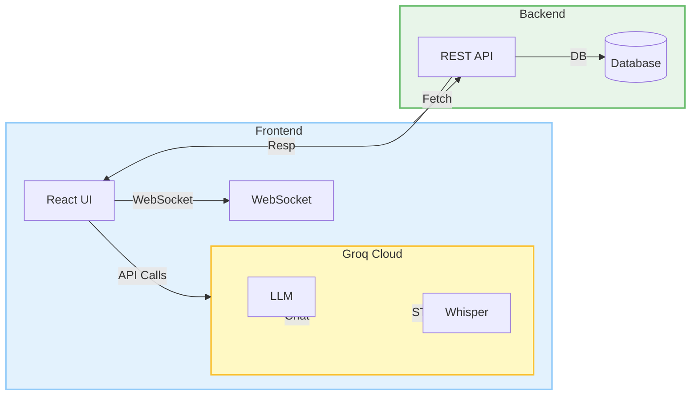

# V-Mitra: Smart AI Business Companion

## 📖 Introduction
**V-Mitra** is a cutting-edge **AI-powered Business Operating System** designed specifically for Indian merchants. It bridges the gap between traditional bookkeeping and modern digital management by allowing users to manage their entire business using natural language voice commands in **Hinglish** (Hindi + English).

Whether it's recording a sale ("Ek kilo cheeni bechi"), checking stock ("Doodh khatam ho gaya kya?"), or analyzing profits ("Aaj kitna munafa hua?"), V-Mitra acts as a smart companion that simplifies complex business operations.

---

## 🚀 Key Features

- **🗣️ Voice-First Interface:** Interact with your business data using natural voice commands, powered by **Groq Whisper** transcription and **Groq Llama 3** reasoning, with browser-native text-to-speech output in natural Hinglish.
- **📦 Smart Inventory Management:** Real-time tracking of stock levels with automatic alerts for low inventory.
- **💰 Sales & Transaction Recording:** Seamlessly record sales and expenses through voice commands or manual entry.
- **📊 Business Insights:** Instant access to daily revenue, profit margins, and sales trends via an intuitive dashboard.
- **🇮🇳 Localized for India:** Built to understand the unique linguistic blend (Hinglish) used by Indian shopkeepers.
- **🔑 Pro Key Selection:** Fully offline-capable API key configuration interface in the UI to manage and swap Groq Pro keys.

---

## 🛠 Technology Stack

### **Frontend (User Interface)**
- **Framework:** [React 19](https://react.dev/)
- **Build Tool:** [Vite](https://vitejs.dev/)
- **Language:** [JavaScript (ES6+) / JSX](https://developer.mozilla.org/en-US/docs/Web/JavaScript)
- **Styling:** [Tailwind CSS](https://tailwindcss.com/)
- **AI Integration:** [Groq Cloud API](https://groq.com/) (Llama-3.3-70b-versatile for Chat & Tools, Whisper-large-v3-turbo for Speech-to-Text)
- **Text-to-Speech:** Browser Web Speech API (`SpeechSynthesis`)
- **Visualizations:** [Recharts](https://recharts.org/) & [Lucide React](https://lucide.dev/) (Icons)

### **Backend (Business Logic)**
- **Framework:** [Spring Boot 3.2.2](https://spring.io/projects/spring-boot)
- **Language:** [Java 17](https://www.java.com/)
- **Build Tool:** [Maven](https://maven.apache.org/)

---
## 🏗️ Architecture Design

The following diagram shows the high‑level architecture of V‑Mitra, illustrating how the frontend, AI services, and optional Java backend interact.


## 🚀 Getting Started

### Prerequisites
- Node.js (v18+)
- NPM
- A Groq API Key

### Installation

1. Clone the repository and navigate to the project directory.
2. Install frontend dependencies:
   ```bash
   npm install
   ```
3. Create a `.env` file in the root directory and add your Groq API Key:
   ```env
   GROQ_API_KEY=your_groq_api_key_here
   ```
4. Start the frontend development server:
   ```bash
   npm run dev
   ```
   The app will run on `http://localhost:3000`.

---

## 📂 Java Backend Setup (Optional)

If running the Spring Boot backend service:
1. Build the package:
   ```bash
   mvn clean package -DskipTests
   ```
2. Run the application:
   ```bash
   java -jar target/backend-0.0.1-SNAPSHOT.jar
   ```
